# Celestial Lighting System - C4 Architecture Diagrams

## Level 1: System Context Diagram

```mermaid
graph TB
    User["👤 User<br/><i>Person</i><br/>Controls lights manually<br/>via Aurora dimmer"]
    
    CLS["🏠 Celestial Lighting System<br/><i>Software System</i><br/>Automatically adjusts Philips Hue lights<br/>based on sun/moon position"]
    
    HueBridge["💡 Philips Hue Bridge<br/><i>External System</i><br/>Zigbee hub that controls<br/>Hue bulbs and Aurora dimmer"]
    
    SunMoon["☀️🌙 Celestial Bodies<br/><i>External System</i><br/>Provides position data<br/>via astronomical calculations"]
    
    User -->|"Rotates/clicks dimmer"| HueBridge
    CLS -->|"Commands lights<br/>(REST API)"| HueBridge
    HueBridge -->|"Events<br/>(dimmer actions)"| CLS
    SunMoon -.->|"Position data<br/>(calculated)"| CLS
    
    style CLS fill:#08427B,color:#fff
    style User fill:#08427B,color:#fff
    style HueBridge fill:#999999,color:#fff
    style SunMoon fill:#999999,color:#fff
```

## Level 2: Container Diagram

## Level 3: Component Diagram - AppDaemon Container

```mermaid
graph TB
    subgraph "AppDaemon Container"
        SCHEDULER["⏰ Scheduler<br/><i>Component</i><br/>Runs update_lights()<br/>every 60 seconds"]
        
        EVENTLISTENER["👂 Event Listener<br/><i>Component</i><br/>Subscribes to hue_event<br/>for Aurora actions"]
        
        CELESTIALCALC["🌟 Celestial Calculator<br/><i>Component</i><br/>Calculates sun/moon positions<br/>and color temperatures"]
        
        LIGHTCONTROLLER["💡 Light Controller<br/><i>Component</i><br/>Sends commands to HA<br/>to control lights"]
        
        STATEMANAGER["📊 State Manager<br/><i>Component</i><br/>Tracks enabled/disabled<br/>and override states"]
    end
    
    subgraph "Home Assistant Core"
        HAAPI["🔌 HA API<br/><i>Interface</i><br/>WebSocket & REST"]
        
        ENTITIES["📦 Entities<br/><i>Data Store</i><br/>sun.sun<br/>light.*<br/>sensor.*"]
    end
    
    subgraph "External Libraries"
        EPHEM["📐 Ephem<br/><i>Library</i><br/>Moon calculations"]
    end
    
    SCHEDULER -->|"Triggers"| CELESTIALCALC
    EVENTLISTENER -->|"Aurora input"| STATEMANAGER
    CELESTIALCALC -->|"Position request"| EPHEM
    CELESTIALCALC -->|"Color/brightness"| LIGHTCONTROLLER
    LIGHTCONTROLLER -->|"Commands"| HAAPI
    HAAPI -->|"Updates"| ENTITIES
    STATEMANAGER -->|"Override control"| LIGHTCONTROLLER
    HAAPI -->|"Events"| EVENTLISTENER
    HAAPI -->|"State queries"| CELESTIALCALC
    
    style CELESTIALCALC fill:#08427B,color:#fff
    style LIGHTCONTROLLER fill:#08427B,color:#fff
```

## Level 3: Component Diagram - Celestial App Logic

```mermaid
graph TB
    subgraph "Celestial App Components"
        INIT["🚀 Initialize<br/>Sets up schedules<br/>and event listeners"]
        
        UPDATE["🔄 update_lights()<br/>Main loop<br/>Runs every 60s"]
        
        SUNLOGIC["☀️ Sun Logic<br/>calculate_color_temp()<br/>Elevation → Kelvin"]
        
        MOONLOGIC["🌙 Moon Logic<br/>get_moon_position()<br/>Phase & altitude → RGB"]
        
        DIMMERHANDLER["🎛️ Dimmer Handler<br/>handle_aurora_event()<br/>Process physical input"]
        
        HASERVICE["📡 HA Service Caller<br/>call_service()<br/>Send to light entities"]
    end
    
    subgraph "Data Flow"
        SUNDATA["Sun Data<br/>elevation: -10 to 90°<br/>azimuth: 0-360°"]
        
        MOONDATA["Moon Data<br/>altitude: -90 to 90°<br/>phase: 0-100%"]
        
        LIGHTCMD["Light Commands<br/>kelvin: 2000-6500<br/>rgb: [R,G,B]<br/>brightness: 0-255"]
    end
    
    INIT -->|"Schedules"| UPDATE
    UPDATE -->|"Check time"| SUNLOGIC
    UPDATE -->|"Check time"| MOONLOGIC
    
    SUNDATA -->|"Input"| SUNLOGIC
    MOONDATA -->|"Input"| MOONLOGIC
    
    SUNLOGIC -->|"Kelvin + brightness"| LIGHTCMD
    MOONLOGIC -->|"RGB + brightness"| LIGHTCMD
    
    DIMMERHANDLER -->|"Override"| LIGHTCMD
    LIGHTCMD -->|"Send"| HASERVICE
    
    style UPDATE fill:#08427B,color:#fff
    style SUNLOGIC fill:#FFA500,color:#fff
    style MOONLOGIC fill:#4B0082,color:#fff
```

## Data Flow Sequence

## Key Architecture Decisions

### Why AppDaemon?
- **Python flexibility**: Full Python environment with external libraries
- **Persistent state**: Can maintain state between executions
- **Event-driven**: Real-time response to Aurora dimmer
- **Integrated**: Runs on Home Assistant Green, no external computer needed

### Why Not Direct HA Automations?
- **Complex calculations**: Moon position math needs ephem library
- **State management**: Override modes, gradual transitions
- **Code organization**: 200+ lines of logic better in Python than YAML

### Communication Patterns
1. **Polling** (60-second timer): For gradual celestial changes
2. **Event-driven** (WebSocket): For immediate Aurora dimmer response
3. **REST API** (to Hue Bridge): Standard integration pattern

### Data Storage
- **No persistence needed**: All calculations are real-time
- **State in memory**: Override flags, last positions
- **Config in YAML**: Light entities, update intervals

## Deployment Architecture

```mermaid
graph LR
    subgraph "Development"
        PYCHARM["💻 PyCharm<br/>Local development"]
        TESTSCRIPT["🧪 Test Script<br/>Direct API calls"]
    end
    
    subgraph "Home Assistant Green"
        SAMBA["📁 Samba Share<br/>File access"]
        APPDAEMON2["📦 AppDaemon<br/>Production runtime"]
    end
    
    PYCHARM -->|"Edit files"| SAMBA
    SAMBA -->|"Auto-reload"| APPDAEMON2
    TESTSCRIPT -->|"REST API"| APPDAEMON2
    
    style PYCHARM fill:#00C853,color:#fff
    style APPDAEMON2 fill:#1168bd,color:#fff
```

